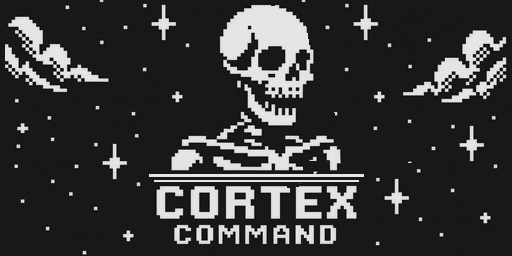
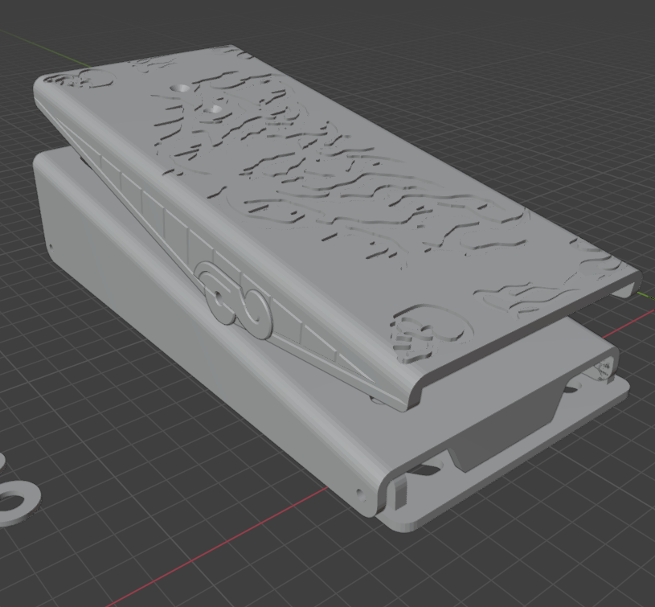
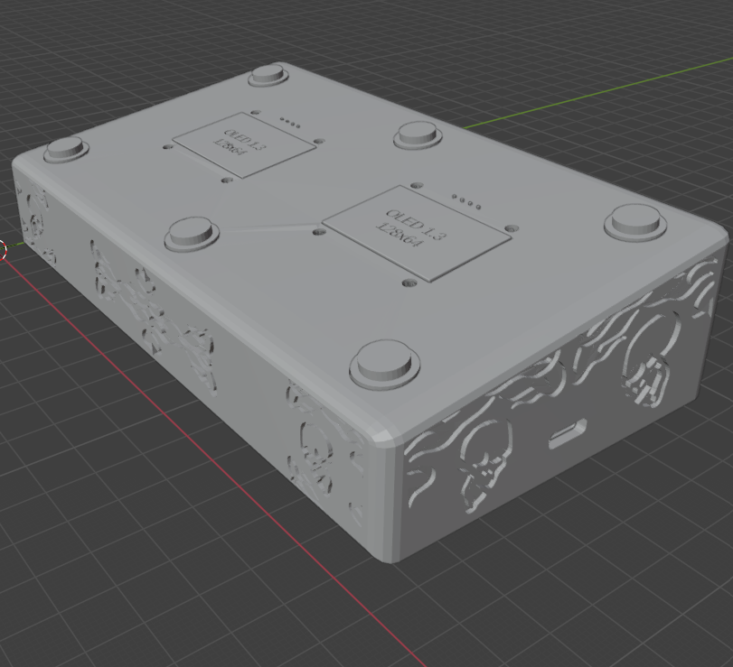

# Cortex-Command

  

A DIY **USB MIDI foot controller** built on the **Arduino Pro Micro (ATmega32U4)** — featuring **6 footswitches**, **dual OLED status screens**, and a **TRS expression (wah) input**.

> Goal: a rugged, stage-friendly controller that speaks native USB MIDI and feels like a real piece of gear, not a science fair project.

<table align="center">
  <tr>
    <td align="center">
      
    </td>
    <td align="center">
      
    </td>
  </tr>
</table>

---
## CREDITS TO:
Adafruit Midi Foot pedal, i sourced their 3d files for the foot pedal and made lots of changes to it. Code needed to be done in C++ since I was using a different microcontroller.
https://learn.adafruit.com/midi-foot-pedal/
---

## Features
- **Native USB MIDI** via ATmega32U4 (no extra MIDI interface needed)
- **6 momentary footswitches** (INPUT_PULLUP wiring)
- **2× 1.3" I2C OLED displays** (shared bus, different I2C addresses)
- **Expression pedal input** over **TRS** (Tip = 5V, Ring = signal, Sleeve = GND)
- Modular build: main controller + separate expression pedal enclosure (3D FILES ARE INCLUDED /3D files)

---

## Project Gallery / Build Snapshots

**Main controller enclosure**

- Top view / pedal-style layout            - Bottom view / component layout  

    <td align="center">
      
    </td>
    <td align="center">
      
    </td>
  </tr>
</table>

---

## Bill of Materials (BOM)

| Qty | Part |
|---:|---|
| 6 | 12mm Momentary Push Button (SPST, ON/OFF) |
| 2 | TRS 1/4" Female Jack |
| 1 | 1/4" cable (3 ft) |
| — | Dupont wires |
| 2 | 1.3" OLED I2C 128×64 (SH1106 / “12864”) |
| — | Assorted M3 screws |
| 1 | Arduino Pro Micro (ATmega32U4, USB-C) |
| 1 | WH148 Type B10K linear potentiometer (expression pedal) |

---

## Hardware Wiring (Fritzing Diagrams)

This section documents the **final physical wiring** of Cortex Command using Fritzing diagrams.
All images are stored locally in the `/images` directory and reflect the exact build.

---

## OLED Displays (Dual I2C)

Two 1.3" OLED displays are connected on a shared I2C bus.

**Connections**
- SDA → D2  
- SCL → D3  
- VCC → 5V  
- GND → GND  

⚠️ Each display must have a **unique I2C address**:
- Display 1 → `0x3C`
- Display 2 → `0x3D`

---

## Expression / Wah Pedal (TRS)

The expression pedal connects via a **1/4\" TRS jack** and uses a B10K linear potentiometer
configured as a voltage divider.

**TRS Mapping**
- Tip → +5V (VCC)
- Ring → Analog Signal (A0)
- Sleeve → Ground (GND)

This allows the pedal to output a stable **0–5V signal** into analog pin A0.

---

## Footswitches (6× Momentary Buttons)

All six footswitches use the Arduino `INPUT_PULLUP` configuration.

**Wiring Method**
- One terminal → Digital input pin
- One terminal → Common GND
- Pressed = LOW

**Pin Assignments**
| Button | Pin | MIDI CC |
|------:|-----|---------|
| 1 | D4 | CC 101 |
| 2 | D6 | CC 102 |
| 3 | D7 | CC 103 |
| 4 | D8 | CC 104 |
| 5 | D9 | CC 105 |
| 6 | D10 | CC 106 |

---

## Firmware

The Arduino sketch handling:
- USB MIDI
- Button scanning + debouncing
- Expression pedal analog input
- OLED rendering

is located here:

 **[`/firmware/sketch_midi.ino`](firmware/sketch_midi.ino)**

(Requires an Arduino Pro Micro / ATmega32U4 for native USB MIDI support.)

---

## Notes
- All grounds are tied to a **single common GND**
- OLED instability usually indicates:
  - Incorrect I2C address
  - SDA/SCL swapped
  - Weak USB power source
 
<h2 align="center">Display Demo</h2>

  <a href="images/Display%20Video.mp4">▶ Watch the display demo (MP4)</a>

